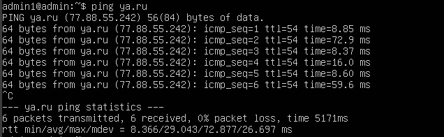
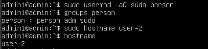
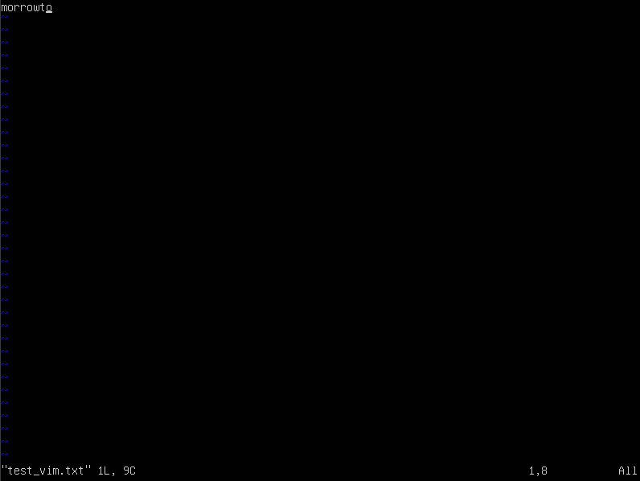
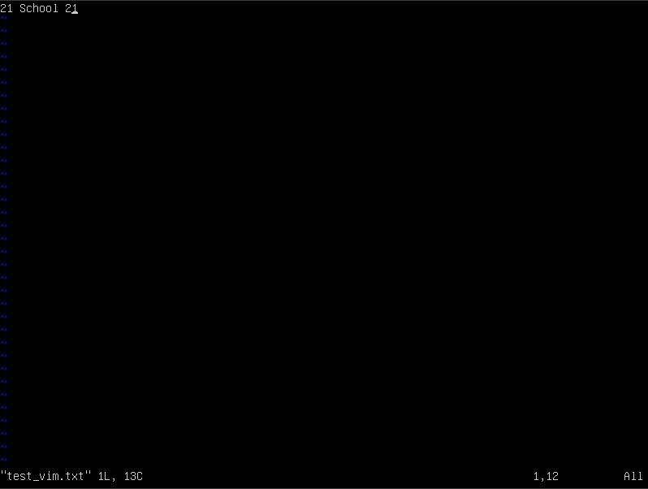
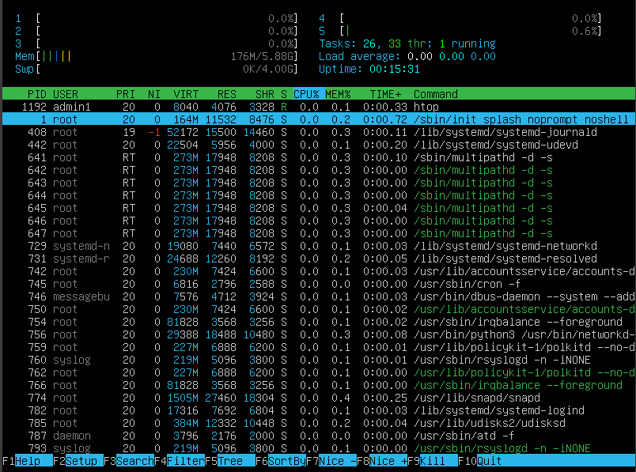

## Part 1. Installation of the OS

* command cat /etc/issue.

    

## Part 2. Creating a user

* Создание нового пользователя и добавление его в группу adm

    sudo useradd person

    sudo usermod -a -G adm person

    cat /etc/passwd

    

## Part 3. Setting up the OS network
* Изменение названия машины

    

* Установка временной зоны

    

* Вывод названия сетевых интерфейсов

    

    Интерфейс lo виртуальный интерфейс всегда присутствующий на linux. Используется для отладки сетевых программ и запуска серверных приложений на локальной машине. 
    У него всегда адрес 127.0.0.1

* Получаем новый IP от DHCP

    

    DHCP - Dynamic Host Configuration Protocol

* Внешний и внутренний IP

    

* Задаем статичный IP в конфигурационном файле
    sudo vim /etc/netplan/00-installer-config.yaml

    

    Применяем изменения:
    sudo netplan apply

* Перезагружаем: reboot

    Проверяем что у нас теперь статичный IP

    

    Пингуем удаленные хосты

    

    

## Part 4. OS Update
* Установка обновлений

   sudo apt upgrade

    

## Part 5. Using the sudo command
*  Наделение правами другого пользователя и изменение названия машина с правами root от другого пользователя:

    

    С помощью sudo (substitute user and do, подменить пользователя и выполнить) пользователь может выполнить привелигиированные команды без необходимости быть суперпользователем root.
## Part 6. Installing and configuring the time service
* Установка и настройка службы времени

    sudo apt install systemd-timesyncd

    sudo systemctl enable systemd-timesyncd

    sudo systemctl start systemd-timesyncd

    

## Part 7. Installing and using text editors
* Сохранение

    vim - :wq and Enter

    

    nano - Ctrl + O and Enter

    

    joe - Ctrl + K and X and Enter

    

* Выход без сохранения

    vim - :q!
    
    

    nano - Ctrl + X and NO

    

    joe - Ctrl + C and YES

    

* Поиск по файлу

    vim : /morrowto

    

    nano - Ctrl + W and morrowto

    

    joe - Ctrl + K and F and morrowto

    

    vim - :s/"что"/"чем"

    

    nano - Ctrl + \ 

    

    joe - Ctrl + K and F and R(eplace)
    
    

## Part 8. Installing and basic setup of the SSHD service
* sudo apt install openssh-server

* sudo systemctl enable sshd

* Изменил в файле порт с 22 на 2022
    sudo nano /etc/ssh/sshd_config

* Наличие процесса sshd

    ps -aux | grep sshd
    
    ps - команда для того чтобы посмотреть процессы
    
    -a - включает процессы других пользователей
    -u - выводит информацию в удобочитаемом формате, включая пользователя, CPU, память, время и команду
    -x - включает процессы, не привязанные к терминалу
    | - перенаправляет вывод ps -aux в команду grep
    grep sshd - команда для поиска строки "sshd"

* reboot

* netstat -tan

    
    
    Ключи:
    
    -t Отображает TCP подключения

    -a Отображает все активные TCP-подключения и порты TCP и UDP, на которых    компьютер прослушивает

    -n Отображает активные TCP-подключения, однако адреса и номера портов выражаются числовым образом и не предпринимается никаких попыток определения имен
    
* Столбцы
    Proto - протокол (tcp, udp, raw), используемый сокетом

    Recv-Q - счётчик байт не скопированных программой пользователя из этого сокета
    
    Send-Q - счётчик байтов, не подтверждённых удалённым узлом

    Local Address - адрес и номер порта локального конца сокета

    Foreign Address - адрес и номер порта удалённого конца сокета

    State - состояние сокета

    LISTEN - cокет ожидает входящих подключений

    IP-адрес 0.0.0.0 — это немаршрутизируемый адрес IPv4, который можно использовать в разных целях, в основном, в качестве адреса по умолчанию или адреса-заполнителя. Несмотря на то, что адрес 0.0.0.0 может использоваться в компьютерных сетях, он не является адресом какого-либо устройства.

## Part 9. Installing and using the top, htop utilities
* top:

    uptime 5 min

    1 user

    load average: 0.00, 0.00, 0.00

    Tasks: 130 total

    %Cpu(s): 0.0 us, 0.1 sy, 0.0 ni, 99.9 id, 0.0 wa, 0.0 hi, 0.0 si, 0.0 st

    Mib Mem: 6018.2 total, 5556.9 free, 174.2 used, 287.2 buff/cache

    641

    641

* htop

    Сортировка по PID

    

    Сортировка по CPU

    

    Сортировка по MEM

    

    Сортировка по TIME

    

    Фильтр sshd

    

    Поиск syslog

    ![alt text]../misc/images/(9_7.PNG)

    Добавление hostname, clock, uptime

    

## Part 10. Using the fdisk utility
* Disk /dev/sda: 65.38 GiB, 70189383680 bytes, 137088640 sectors, 4G

    

    

## Part 11. Using the df utility
* df

    

    килобайты

* df -Th

    

    ext4

## Part 12. Using the du utility

* du

    

* du -hs /home

    

* sudo du -hs /var 

    

* sudo du -hs /var/log

    

* sudo -h /var/log/*

    

## Part 13. Installing and using the ncdu utility

* sudo apt install ncdu

* ncdu /home

    

* ncdu /var

    

* ncdu /var/log/

    

## Part 14. Working with system logs

* vim /var/log/dmesg

    vim /var/log/syslog

    vim /var/log/auth.log

* Время последнего входа: Jun 30, 02:55:35, user admin1, method login

    

* Restart sshd: sudo systemctl restart ssh

    

## Part 15. Using the CRON job scheduler

* crontab -e
*/2 * * * * uptime

* syslog, uptime is working

    
* Задачи cron
    
    

* Удалил задания из планировщика задач

    

It's all!